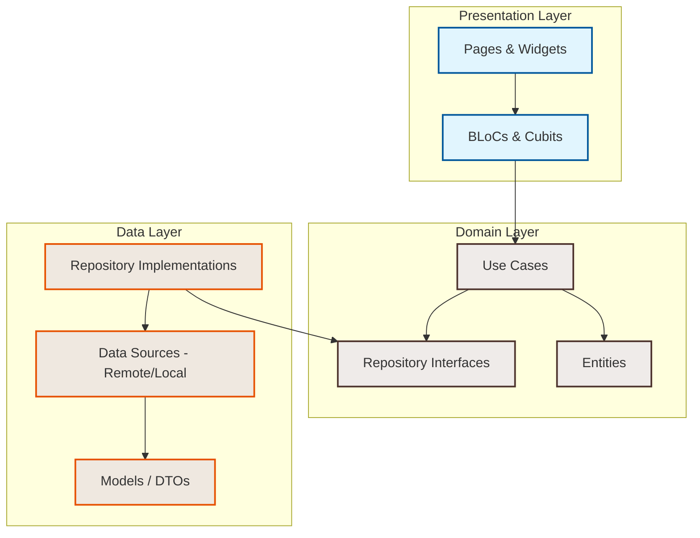

# RizqMart - Modern E-Commerce & Grocery App

[](https://flutter.dev)
[](https://dart.dev)
[](https://firebase.google.com)
[](https://stripe.com)
[](https://ai.google.dev/)

RizqMart is a premium, feature-rich, and robust e-commerce and supermarket mobile application. Engineered with **Flutter & Dart**, the app is built on **Clean Architecture** principles and utilizes **BLoC** state management. It leverages **Firebase** as its core backend service, integrates **Stripe** for payment processing, and harnesses the power of Google's **Gemini AI (`gemini-2.0-flash`)** to provide an intelligent meal planning and automated grocery list generator ("Cook Tonight").

---

## 🌟 Key Features

### 🏛️ Engineering & Architecture
*   **Clean Architecture**: Structured into distinct layers—**Domain**, **Data**, and **Presentation**—ensuring high testability, separation of concerns, and clean decoupling of components.
*   **BLoC Pattern**: Predictable state management using `flutter_bloc` to cleanly handle page flows, remote requests, and localized state.
*   **Dependency Injection**: Modular service locator configuration powered by `get_it`.

### 🔐 Authentication & Accounts
*   **Firebase Authentication**: Secure signup and sign-in using credentials (email and password).
*   **Social Sign-In**: Integration with **Google Sign-In** for seamless user onboarding.
*   **Password Reset**: Built-in forgot-password recovery flow.

### 🧠 AI-Powered "Cook Tonight" (Meal Planner)
*   Allows users to query any recipe or dish (e.g., *Spaghetti Carbonara*, *Paneer Butter Masala*).
*   Utilizes the **Google Gemini API (`gemini-2.0-flash`)** via a dedicated client-side service to analyze the request and generate an exact list of ingredients scaled by serving size.
*   **Instant Cart Addition**: With a single tap, the generated ingredients are matched and added straight to the user's cart for checkout.

### 💳 Checkout & Payment Gateway
*   **Stripe SDK Integration**: Implements Stripe's secure **Payment Sheet** UI flow.
*   **Backend Payment Processing**: Express-based backend API handles secure payment intents, client secrets, and confirmations off-device.
*   **Saved Cards**: Securely stores and retrieves user card tokens for lightning-fast checkout.
*   **Flexible Payment Methods**: Supports Cash on Delivery (COD), Stripe Card Payment, and digital Wallet balance.

### 🎒 Digital Wallet System
*   **Top-Up & Credits**: Users can add funds to their wallet balance securely.
*   **In-App Payments**: Quick purchases using wallet funds.
*   **Transaction Logs**: Tracks every wallet credit, purchase debit, and withdrawal.
*   **Withdrawal Requests**: Allows users to initiate withdrawals back to their accounts.

### 🗺️ Geolocation & Addresses
*   **Address Book**: Store and manage multiple delivery locations.
*   **Auto-Location Lookup**: Fetches exact GPS coordinates and formats address fields using the `geolocator` and `geocoding` packages.

### 💬 Live Support Chat
*   **Real-time Interaction**: A customer support chat system connecting users to administration/help desk instantly.
*   Powered by Cloud Firestore real-time snapshots.

### 🏷️ Coupon & Promotions Engine
*   In-app coupon application where promotional discount codes can be fetched, validated, and applied to cart sub-totals before checkout.

### 🔔 Notifications & Reviews
*   **Push Notifications**: Integrated with **Firebase Cloud Messaging (FCM)** for background alerts and order updates.
*   **Local Notifications**: Programmed via `flutter_local_notifications` for real-time app events.
*   **Reviews & Ratings**: Verified review system for products, enabling buyers to post ratings and qualitative text.

---

## 🛠️ Technology Stack

| Layer | Technology / Package |
| :--- | :--- |
| **Frontend Framework** | Flutter SDK (Dart) |
| **State Management** | `flutter_bloc` & `bloc` |
| **Dependency Injection** | `get_it` |
| **Database & Auth** | Firebase Auth & Cloud Firestore |
| **Push Notifications** | Firebase Cloud Messaging (FCM) |
| **Backend Functions** | Firebase Cloud Functions (Node.js/Express) |
| **Payment Processor** | Stripe Payment Gateway (`flutter_stripe`) |
| **AI Integration** | Google Gemini API (`gemini-2.0-flash`) |
| **Image Hosting** | Cloudinary (via Express backend API) |
| **Design Utilities** | Google Fonts, Lottie, Shimmer, Overlapped Carousel |

---

## 🚀 Step-by-Step Installation & Setup

Follow these detailed steps to set up and run the RizqMart application on your local machine.

### 📋 Prerequisites

Before proceeding, ensure you have the following installed:
*   [Flutter SDK](https://docs.flutter.dev/get-started/install) (version **3.27.0** or above recommended)
*   [Dart SDK](https://dart.dev/get-started) (version **3.6.0** or above)
*   [Node.js & npm](https://nodejs.org/en) (for Firebase Cloud Functions deployment)
*   [Firebase CLI](https://firebase.google.com/docs/cli) (`npm install -g firebase-tools`)
*   An active **Stripe** account (for publishable and secret keys)
*   A **Cloudinary** account (for image upload integrations)
*   A **Google Gemini** API key (from Google AI Studio)

---

### Step 1: Clone the Repository
Clone the codebase to your development workspace:
```bash
git clone <repository-url>
cd rizqmart_app
```

### Step 2: Install Flutter Dependencies
Download all packages specified in the `pubspec.yaml`:
```bash
flutter pub get
```

### Step 3: Configure Frontend Environment Variables (`.env`)
Create a `.env` file at the root of the project:
```properties
CLOUDINARY_CLOUD_NAME=your_cloudinary_cloud_name
PRESET_NAME=your_cloudinary_preset_name
STRIPE_PUBLISHABLE_KEY=pk_test_your_publishable_key
GEMINI_API_KEY=AIzaSy_your_gemini_api_key
```
> [!IMPORTANT]
> Ensure the `.env` file is placed directly at the project root and is successfully referenced under the `assets` section in your `pubspec.yaml` (which is configured by default).

---

### Step 4: Configure Firebase Services
1. Go to the [Firebase Console](https://console.firebase.google.com/) and create a new project named **RizqMart**.
2. Enable the following services:
   *   **Authentication** (Enable *Email/Password* and *Google* sign-in providers).
   *   **Firestore Database** (Create database in test mode or with security rules enabled).
   *   **Cloud Messaging** (For push notifications).
3. Log in to Firebase CLI:
   ```bash
   firebase login
   ```
4. Install the FlutterFire CLI tool and run configuration:
   ```bash
   dart pub global activate flutterfire_cli
   flutterfire configure --project=your-firebase-project-id
   ```
5. Choose the platforms you intend to support (Android, iOS, Web, macOS, Windows). This command generates `lib/firebase_options.dart` automatically.

---

### Step 5: Deploy Firebase Cloud Functions (Backend APIs)
The payment transactions and image uploads are offloaded to an Express API deployed on Firebase Cloud Functions.

1. Navigate to the `functions` directory:
   ```bash
   cd functions
   ```
2. Install Node.js dependencies:
   ```bash
   npm install
   ```
3. Set up the environment variables for your backend. Create a `.env` file inside the `functions` folder:
   ```properties
   STRIPE_SECRET_KEY=sk_test_your_secret_stripe_key
   CLOUDINARY_CLOUD_NAME=your_cloudinary_cloud_name
   API_KEY=your_cloudinary_api_key
   SECRET_KEY=your_cloudinary_api_secret
   ```
4. Deploy the cloud functions to your Firebase project:
   ```bash
   firebase deploy --only functions
   ```
5. Once deployment completes, note down the function URL printed in the terminal (looks like `https://us-central1-your-project-id.cloudfunctions.net/api`).
6. Update the backend URL `_baseUrl` in the Flutter source code:
   *   File path: `lib/features/data/data_source/services/stripe_services.dart` (line 17-18)
   *   Replace the URL string with your deployed Firebase Function endpoint.

---

## 🏗️ Architecture Design

RizqMart strictly adheres to clean architecture boundaries, separating business rules from UI components.



*   **Domain Layer**: Contains enterprise-wide business logic. Includes `Entities` (basic data objects), `UseCases` (business operations), and abstract contracts for `Repositories`.
*   **Data Layer**: Contains API clients, local persistence helpers, and maps raw payloads into Domain Entities using `Models`. Contains concrete `Repository` implementations.
*   **Presentation Layer**: Contains widgets representing UI designs and `BLoC` units managing UI states based on incoming triggers (events).

---

## 🏃 Running the Application

After finishing the configuration steps, run the application using your preferred IDE or command line.

### Debug Mode
Run the app in debug mode on a connected device/emulator:
```bash
flutter run
```

### Release Build

To build a release-ready production bundle:

#### Android
```bash
flutter build apk --release
```
The resulting APK will be saved at `build/app/outputs/flutter-apk/app-release.apk`.

#### iOS
```bash
flutter build ios --release
```
Configure your signing profiles in Xcode under `ios/Runner.xcworkspace` before launching the build.

---

## 📄 License
This project is proprietary and confidential. Publication to pub.dev or external registries is restricted.
